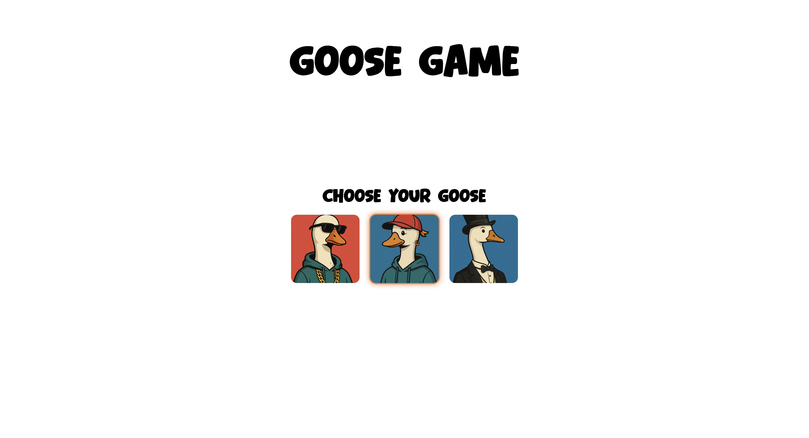
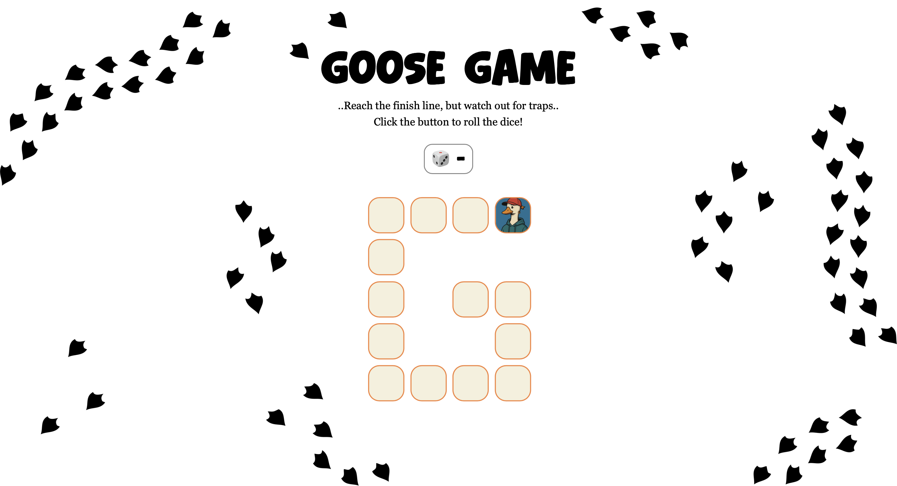
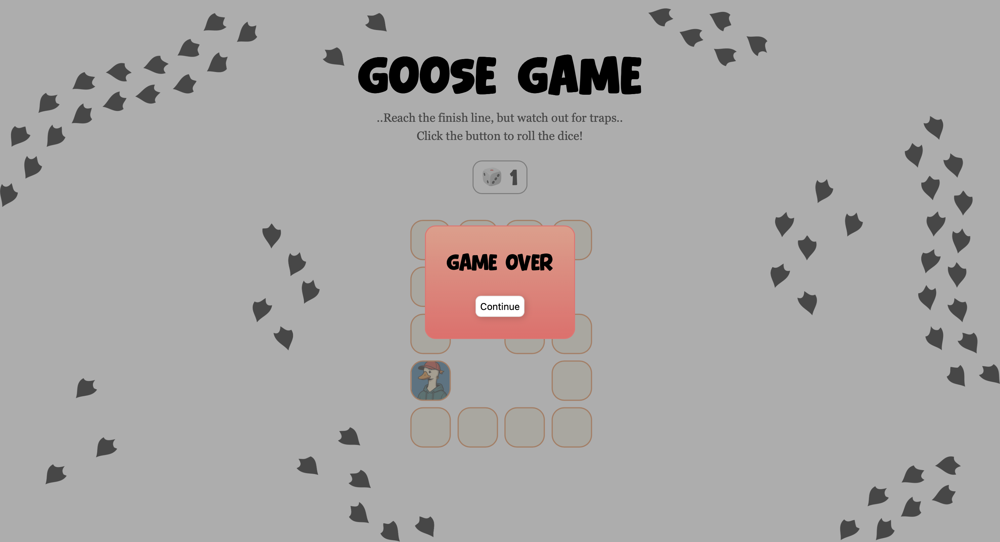
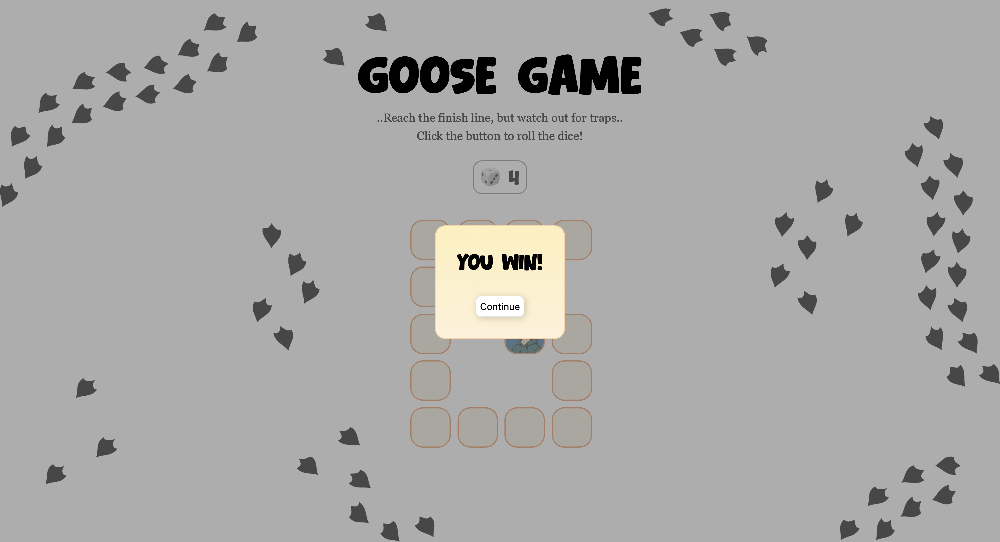
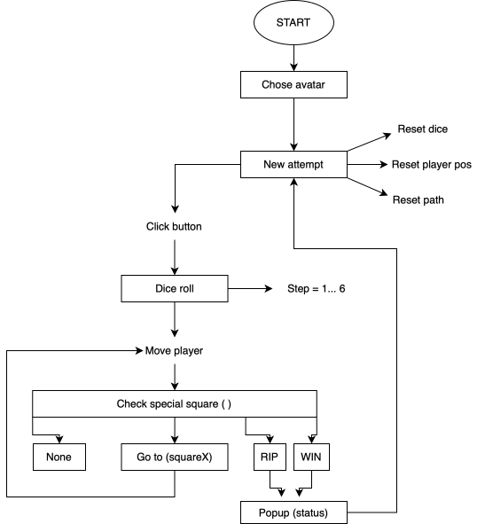

# Assignment 02

## Brief

Choose a “mini-game” to rebuild with HTML, CSS and JavaScript. The requirements are:

- The webpage should be responsive
- Choose an avatar at the beginning of the game
- Keep track of the score of the player
- Use the keyboard to control the game (indicate what are the controls in the page). You can also use buttons (mouse), but also keyboard.
- Use some multimedia files (audio, video, …)
- Implement an “automatic restart” in the game (that is not done via the refresh of the page)

## Screenshots

## Project description

Goose Game is a simple browser mini-game built with HTML, CSS and JavaScript. The player first selects one of three goose avatars, then rolls a dice to move along a G-shaped path. Special squares trigger traps or shortcuts, with sounds and pop-up messages for win and game over.

## Flowchart

## Function list

### setAvatar()
 
- Expression logic:

  It adds a 'click event listener to each avatar image. When the user clicks on one avatar, the function saves the chosen avatar in 'selectedAvatar', updates the "body" class ('avatar-tamarra', 'avatar-street', or 'avatar-elegant'), hides the avatar selection screen and calls 'newAttempt()' to reset the game. 

- Return values: effects on DOM and global state

### newAttempt()
 
- Expression logic:  

  It resets the game state at the beginning of a new attempt: sets 'currPos' and 'dice' back to 0, updates the dice display with 'updateDice()', clears all active tiles with 'resetPath()', and finally calls 'updatePlayerPosition()' to place the player at the start.  

### resetPath()

- Expression logic:

  It loops through all "li" elements in the game path ('tiles') and removes the 'active' class from each one. This clears any previous player position before drawing the new one.  

### updateDice()

- Expression logic:  

  It updates the dice text shown in the UI: if 'dice' is '0' it displays '"-"', otherwise it shows the current dice value.  

### rollDice()

- Expression logic:

  It generates a random integer between 1 and 6, assigns it to 'dice', updates the UI with 'updateDice()', and then calls 'movePlayer(dice)' to move the player forward along the path.

### movePlayer(step)

- Parameters:

  'step' (number): how many squares the player should move forward.  

- Expression logic:

  It computes the next position as 'currPos + step'. If this value is greater than 'PATH_LENGTH', the function stops and the player does not move. Otherwise, it updates 'currPos' with the new value, calls 'updatePlayerPosition()' to update the active tile and then calls 'checkSpeciaklSquare()' to handle possible traps or shortcuts.

### updatePlayerPosition()

- Expression logic:
  It first clears all tiles with 'resetPath()', then finds the "li" element whose 'id' matches the current 'currPos' and adds the 'active' class to it. This visually places the avatar on the correct square.  

### checkSpecialSquare()

- Expression logic: 

  It checks what happens when the player lands on the current square.  
  - If 'urrPos' equals 'PATH_LENGTH', it immediately calls 'handleWin()'.  
  - Otherwise it reads the effect from 'SPECIAL_SQUARES[curPos]'.  
     If the effect is '0', nothing happens.  
     If the effect is '-1', it calls 'handleRip()' for game over.  
     If the effect is a positive number, it sets 'currPos' to that target square (teleport), updates the position with 'updatePlayerPosition()', and then checks again for win or RIP.  

### handleWin()

- Expression logic: 
  It plays the win sound ('winSound') and calls 'popupOutcomeBanner("You win!", "win")' to show the win popup with the correct styling.

### handleRip()

- Expression logic: 
  It plays the fail sound ('failSound') and calls 'popupOutcomeBanner("Game over", "fail")' to show the game over popup with the fail styling.  

### popupOutcomeBanner(message, result)

- Parameters:
  
'message' (string): the text to display in the popup ("You win!", "Game over"').  

'result' (string): the outcome type ("win" or "fail") used as a CSS class.  

- Expression logic: 
  It sets the inner HTML of '#game-outcome' to the given 'message', resets any existing classes on the popup banner, then adds 'active' and the 'result' class to '#popup-banner'. This makes the popup visible and applies the correct gradient style. 