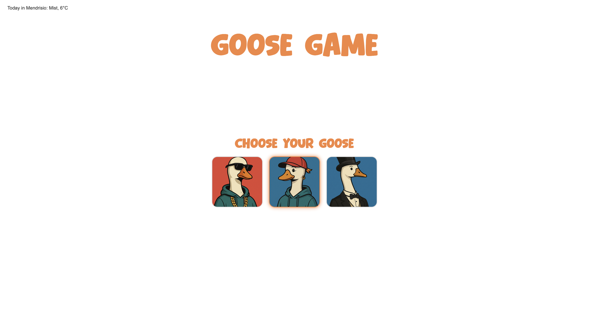
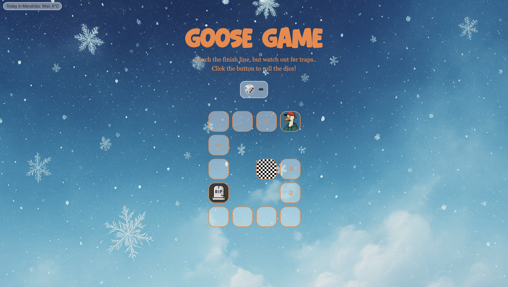
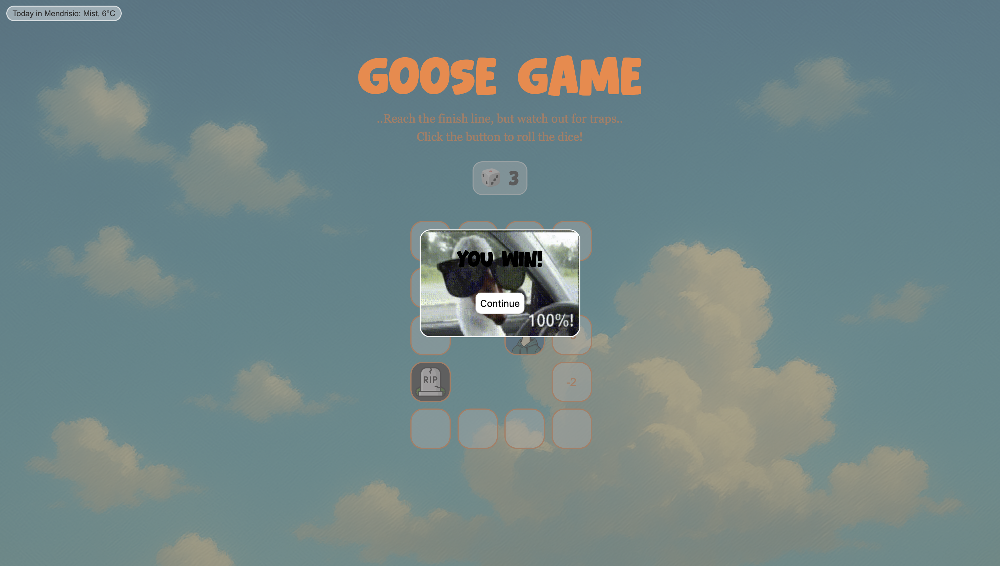
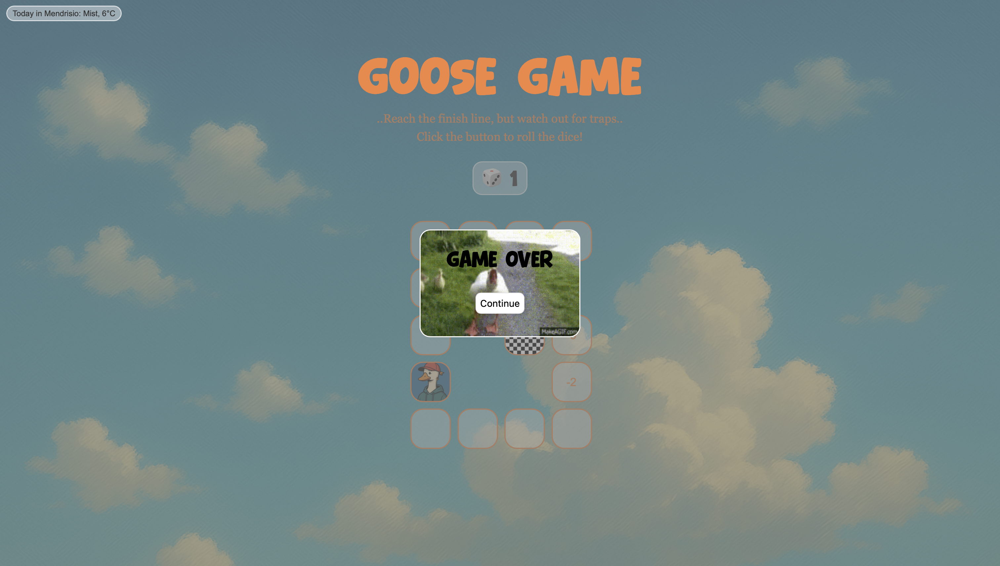
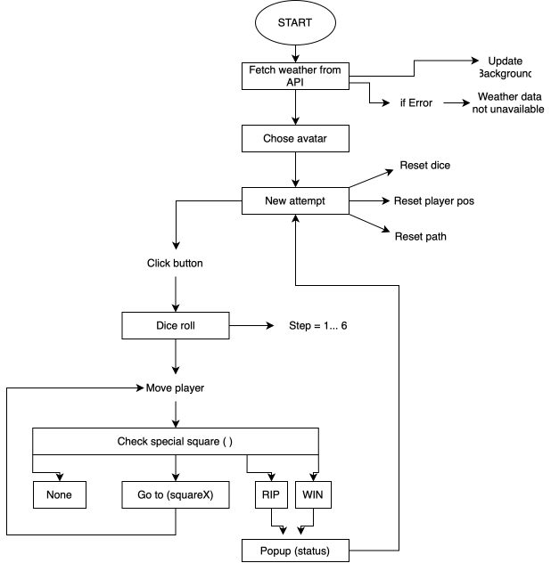

# Assignment 03

## Brief

Upgrade the **Assignment 02** by adding the use of data coming from an external web API. For example, fetch contents (audio, images, video, text, metadata) from online archives, AI generated contents (chatGPT API), data (weather, realtime traffic data, environmental data).

Have a look at the lesson about the API:

[https://wind-submarine-3d4.notion.site/Lesson-5-200d516637bc811aba69e13b0ffe438f?pvs=74](https://www.notion.so/200d516637bc811aba69e13b0ffe438f?pvs=21)

The application **must** have those requirements:

- The webpage is responsive
- Use a web API (you choose which one best fists for your project) to load the data and display them in the webpage
- At least one multimedia file (for user feedback interactions, or content itself)
- Develop a navigation system that allows the user to navigate different sections with related content and functionalities

## Screenshots

## Project description

Goose Game is a browser mini-game built with HTML, CSS and JavaScript: pick one of three goose avatars, roll the dice and move along a G-shaped path with traps and bonuses. A simple weather API changes the background based on real-time conditions.

## Flowchart

## Function list

### updateBackgroundByWeather()
 
- Expression logic:

Calls the weather API with fetch(WEATHER_API_URL). If the response is OK it parses the JSON and passes it to displayWeatherData(), otherwise it goes to displayWeatherError().

### displayWeatherData(data)
 
- Expression logic:  

Reads the main weather condition and temperature from the API response, writes a short text into #weather-info (“Today in Mendrisio: …”) and then calls applyWeatherClass(mainWeather) to update the body background.

### displayWeatherError(error)

- Expression logic:

Logs the error in the console and, if the element exists, sets #weather-info to “Weather data unavailable”. 

### applyWeatherClass(mainWeather)

- Expression logic:  

First removes all previous weather classes from the body, then picks one CSS class (weather-sunny, weather-clouds, weather-rain or weather-snow) depending on the main weather string and adds it to the body.

### setAvatar()

- Expression logic:

Adds a click listener to each .avatar image. When the user selects one, it saves the choice in selectedAvatar, changes the body class (avatar-tamarra, avatar-street, avatar-elegant), hides the avatar screen and calls newAttempt().

### newAttempt()  

- Expression logic:

Resets the game state: sets currPos and dice to 0, updates the dice display with updateDice(), clears the path with resetPath() and finally calls updatePlayerPosition() to place the player back on the start square.

### resetPath()

- Expression logic:

Loops over all tiles in the path and removes the active class, so no square is highlighted before drawing the new position.

### updateDice()

- Expression logic: 

Updates the text inside #dice: if dice is 0 it shows "-", otherwise it shows the current dice value. 

### rollDice()

- Expression logic:

Generates a random integer between 1 and 6, saves it in dice, updates the UI with updateDice() and then calls movePlayer(dice) to move the avatar.

### movePlayer(step)

- Parameters: 

step (number): how many squares to move forward. 

- Expression logic: 

Computes nextPos = currPos + step. If nextPos is greater than PATH_LENGTH it does nothing; otherwise it updates currPos, calls updatePlayerPosition() and then checkSpecialSquare() to handle traps or shortcuts.

### updatePlayerPosition()

- Expression logic:

Calls resetPath() to clear all active tiles, then finds the li with id equal to currPos and adds the active class, so the current square is visually highlighted.

### checkSpecialSquare()

- Expression logic:

Checks what happens on the current square.

-If currPos === PATH_LENGTH, immediately calls handleWin().

-Otherwise reads effect = SPECIAL_SQUARES[currPos] ?? 0.
If effect is 0, nothing happens.
If effect is -1, calls handleRip() for game over.
If effect is a positive number, updates currPos to that target square, calls updatePlayerPosition() and checks again if it’s a win or RIP.

### setBannerGif(gifPath)

- Parameters:

gifPath (string): path of the GIF to show in the popup.

- Expression logic:

If bannerContent exists, sets its background-image style so the chosen GIF appears inside the banner.

### getRandomItem(array)

- Parameters:

array (Array): list of items to choose from.

- Expression logic:

Picks a random index between 0 and array.length - 1 and returns the corresponding element. Used to select a random GIF.

### handleWin() / handleRip()

- Expression logic:

Chooses a random GIF from WIN_GIFS / RIP_GIFS, sends it to setBannerGif(), plays winSound and calls popupOutcomeBanner("You win!", "win" / "Game over", "fail") to show the win / game over popup.

### popupOutcomeBanner(message, result)

- Parameters:

message (string): text to display in the popup.
result (string): outcome type ("win" or "fail") used as a CSS class.

- Expression logic:

Sets the content of #game-outcome to message, clears existing classes on #popup-banner and then adds active plus the result class so the banner appears with the correct style.
