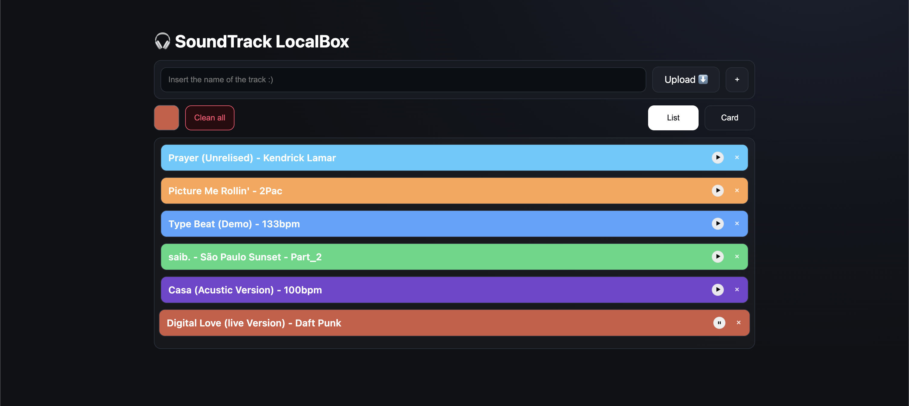
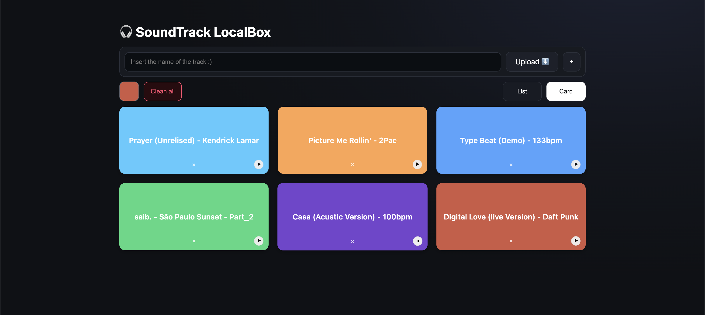

# Assignment 01

## Brief

Starting from the concept of a pinboard, implement a web page that:

- is responsive (properly layout for smartphone, tablet, and desktop)
- allows the user to add and remove elements
- allows the user to coustomize elements (i.e. colors, size)
- allows the switch between two views (at least)

## Screenshots

## Project description

Local Music Manager is a small web application inspired by the concept of a bulletin board. 
It allows users to add and remove local songs, customise colours, switch between list and card views,
and interact via play/pause buttons and single song deletion. 
The layout adapts responsively to all devices.